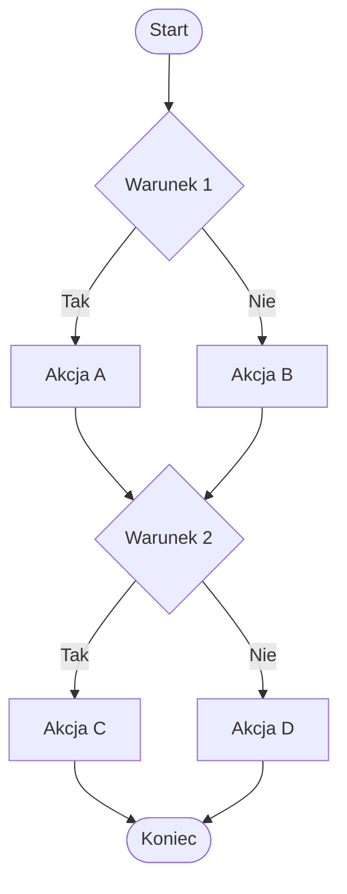

```mermaid
flowchart TD
    Start([Start]) --> Step1{Warunek 1}
    Step1 -- Tak --> ActionA[Akcja A]
    Step1 -- Nie --> ActionB[Akcja B]
    ActionA --> Step2{Warunek 2}
    ActionB --> Step2
    Step2 -- Tak --> ActionC[Akcja C]
    Step2 -- Nie --> ActionD[Akcja D]
    ActionC --> End([Koniec])
    ActionD --> End
```
