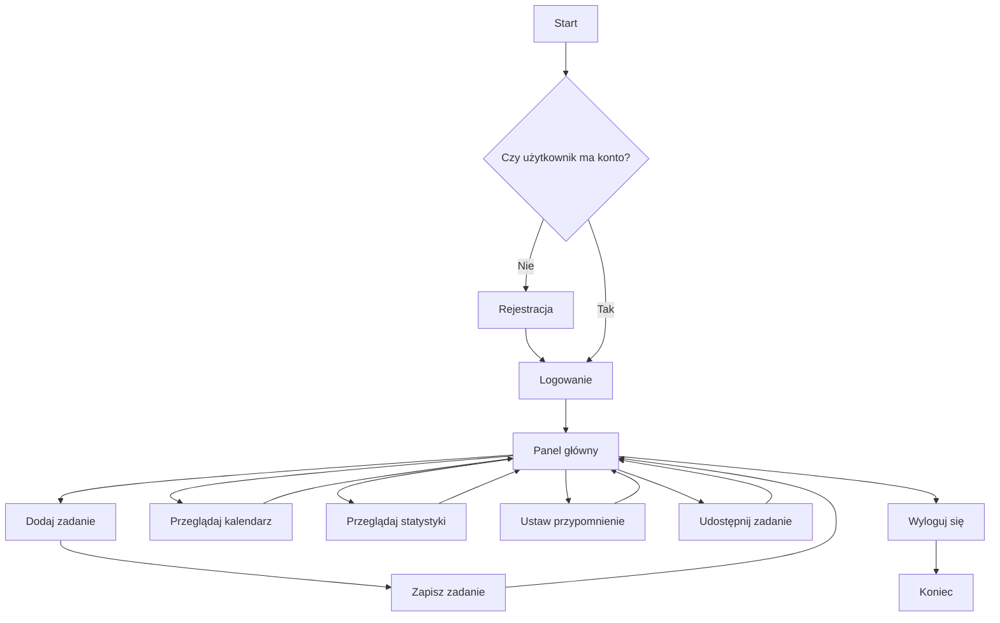

```mermaid
flowchart TD
    A[Start] --> B{Czy użytkownik ma konto?}

    B -- Nie --> C[Rejestracja]
    C --> D[Logowanie]

    B -- Tak --> D[Logowanie]

    D --> E[Panel główny]

    E --> F[Dodaj zadanie]
    E --> G[Przeglądaj kalendarz]
    E --> H[Przeglądaj statystyki]
    E --> I[Ustaw przypomnienie]
    E --> J[Udostępnij zadanie]

    F --> K[Zapisz zadanie]
    K --> E

    G --> E
    H --> E
    I --> E
    J --> E

    E --> L[Wyloguj się]
    L --> M[Koniec]
```
