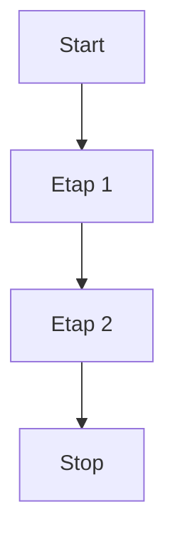

|nazwa kolumny|nazwa kolumny 2|nazwa kolumny 3|
|---|---|---|
|wiers 1a|wiersz 2b|wiersz 3c|
|wiers 1d|wiersz 2e|wiersz 3f|

|Syntax|Description|
|---|---|
|Header|Title|
|Paragraph|Text|

```
wklejamy kod
```

# Glowny naglowek
normalny tekst 

[link do strony](https://www.google.com/)


## Sekcja 1
jakies formatowanie np. **pogrubienie** albo przez ~podkreslenie~ i _kursywa_ 

### Podsekcja
- Nazwa elementu
- Drugi element
- Trzeci element

1. pierwszy
2. drugi
3. trzeci

